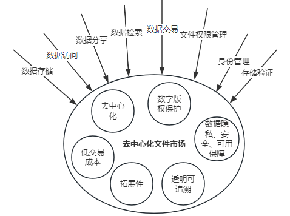
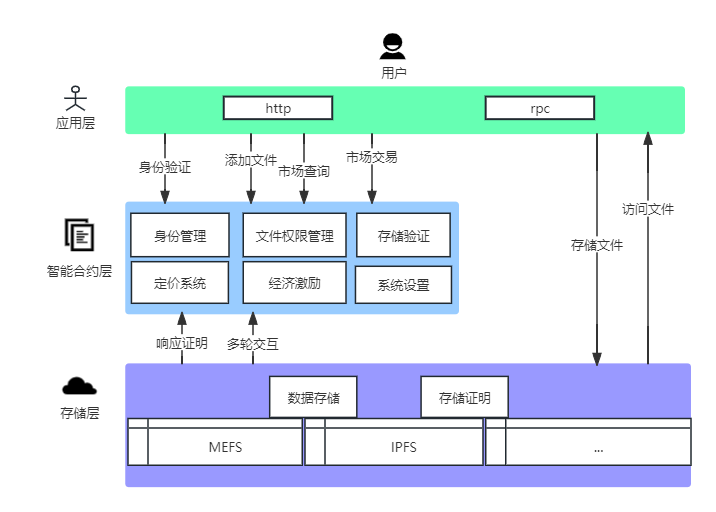

# FileDNS：下一代去中心化文件市场协议

## 引言

        数字化时代赋予了人们更多创造和共享内容的机会，去中心化文件市场正在赋能内容创作者和用户，通过创新的技术和概念重新定义数字文件的管理和交易。随着数字内容的不断增加，去中心化文件市场已经成为数字经济中的关键要素。这些市场的核心目标是实现数字文件的存储、共享、交易和管理，同时减少平台控制和中介的依赖。FileDNS作为Web3中间件和基础设施，提供存储、数据、索引器、访问控制、数据可用性等功能，将借助最新的技术趋势和创新型概念，实现更高的效率、更安全的保障和更优质的用户体验。

## 1. 什么是去中心化文件市场

        去中心化文件市场是一个基于区块链技术的数字市场，允许用户在无需中央控制或媒介的情况下交换、买卖和管理数字文件和内容。它们建立在去中心化的计算平台上，将文件和元数据分布到多个网络节点，从而提供了更高的安全性和可用性。用户可以共享各种类型的内容，如文档、图像、音频、视频和其他数据，而无需依赖传统的中央服务器。这类市场基于区块链技术和智能合约，它们提供了如下一些关键特点和优势：

* **去中心化性质**：去中心化市场不依赖于单一的中央服务器或媒介。取而代之的是，它们使用区块链技术，将文件和交易信息分布到多个节点，这降低了单点故障风险，提高了可用性。

* **数字版权保护**：通过智能合约，去中心化文件市场可以自动执行数字版权和著作权规则。这意味着内容创作者可以更好地控制其作品，并确保其获得公平的报酬。

* **低交易成本**：区块链交易通常较便宜，因为它们不需要中介的费用。这降低了买卖文件和内容的成本，尤其是对小型交易和微支付而言。

* **透明性和可追溯性**：区块链技术提供了完全的透明性，允许用户查看文件的历史和交易记录。这有助于建立信任，并有助于防止欺诈和盗版。

* **拓展性**：通过使用区块链和去中心化存储技术，去中心化文件市场可以更容易地扩展以满足不断增长的需求。

## 2. 技术基础

        FileDNS作为一个去中心化文件市场协议，技术基础涵盖了一系列创新性技术，它们允许用户在无需中央媒介的情况下共享、交易和管理数字文件。以下是FileDNS的关键技术基础。

### 2.1 区块链

        区块链是去中心化文件市场的基石。它是一个分布式的、不可篡改的账本，用于记录文件的所有权、交易历史和智能合约规则。区块链技术提供了安全的交易记录和透明度，允许用户追踪文件的来源和交易历史。

### 2.2 智能合约

        智能合约是在区块链上执行的自动化合同。在去中心化文件市场中，智能合约负责管理数字版权、交易规则和支付。当用户购买文件时，智能合约自动处理付款、文件许可和转让所有权。

### 2.3 分散式存储

        传统文件存储通常依赖于中央服务器，容易受到单点故障的威胁。去中心化文件市场使用分散式存储技术，如MEFS或者IPFS等，将文件分布到网络中的多个节点。这提高了文件的可用性和安全性。

### 2.4 文件标识符

        文件标识符是用于唯一标识和引用文件或数据对象的标识符，有助于用户准确地定位和访问他们所需的文件，用户可以方便地定位、购买、分享和验证文件。每个文件都有其自己的标识符，这有助于确保再市场上没有重复的文件，避免了冗余和混淆。

## 3. FileDNS的基本概念

        FileDNS是一个去中心化的、能够进行文件存储、共享、交易和管理的市场协议，不需要依赖传统的中心化机构（比如知网），用户对自己的文件拥有完全的控制所属权。包含性强，不仅支持艺术创作，比如摄像、画作、音乐、视频、学术论文等，还支持其他各种类型的数据，比如链数据、监控视频、应用备份数据、代码文件等；交易公平透明，文件价格公开，交易历史可追溯；文件资产所有者拥有完全的控制权，未经所有者授权，文件的私密性、安全性、可用性均得到有效保障。

        FileDNS是一个重要创新，有助于解决数据文件管理和交易面临的过度依赖中心化机构、数据可用性保障力度不够、数字身份管理混乱、文件市场中文件类型单一的挑战。FileDNS利用先进的DID（Decentralized Identity）技术将数字身份的控制权交还给用户，并且还创新性地将文件的管理权限扩展至mfileDID模块中，实现用户对文件的百分百独立且灵活得控制管理。此外，FileDNS还结合当前Layer 2市场的欺诈证明（Fraud Proof）和多轮交互式验证思想有效保障数据的可用性。

## 4. FileDNS的技术架构

        FileDNS涉及的技术非常广泛和专业，有加密学相关的运算、校验和数据处理，P2P网络，区块链数据、智能合约和虚拟机，分散式存储，DID去中心化身份管理以及MFileDID去中心化文件权限管理，文件唯一识别符，文件存储欺诈性证明等，每个方面的技术细节都足够展开一个篇章进行分析，但是FileDNS的总体框架，仍旧归属为一个面向Web3.0中间件和基础设施的去中心化文件市场协议。

        FileDNS的技术架构主要可以从三个层面来进行分析。首先从全局角度来看，FileDNS架构分为应用层、智能合约层、存储层。如下图所示。

### 4.1 应用层

        FileDNS的应用层是该去中心化文件市场协议的前端部分，它提供了用户与系统互动的界面和功能，主要为用户提供身份管理、文件存储、文件访问、文件分享、文件交易和管理的功能入口，致力于让用户的操作体验更简单、更便利、更清晰、更流畅和更安全。应用层大致包含以下功能特色：

* **用户友好的界面**：FileDNS的应用层提供用户友好的界面，使用户能够轻松浏览、搜索、上传和管理文件。这包括网页界面、移动应用和其他互动渠道，用户可以选择最适合他们需求的方式来访问FileDNS.

* **文件搜索和发现**：应用层为用户提供了强大的文件搜索和发现功能。用户可以使用关键词、标签或分类来查找他们感兴趣的文件，这使得用户能够快速找到他们需要的内容。

* **文件上传和管理**：用户可以通过应用层轻松上传和管理他们的文件。这包括创建文件的唯一标识符、定义文件的权限和访问控制，以及查看文件的元数据信息。

* **购买和销售文件**：FileDNS的应用层支持用户购买和销售文件。用户可以使用加密货币完成交易，智能合约负责确保交易的安全和可靠性。

* **用户身份管理**：用户可以在应用层管理他们的去中心化身份，这涉及到数字身份标识的创建、管理和授权。这有助于确保用户在网络上的身份安全性和可控性。

* **即时通讯和社交功能**：应用层通常包含即时通讯和社交功能，使用户能够与其他用户交流、分享文件和建立社交关系。

* **多平台支持**：FileDNS的应用层通常会支持多种平台，包括Web、移动设备、桌面应用等。从而使得用户可以跨不同设备轻松访问他们的文件和管理功能。

        FileDNS的应用层是用户与去中心化文件市场互动的入口，使用户能够方便地管理和访问他们的文件，以及参与文件交易和共享。当然，应用层的各个模块也可以单独分割出来作为一个独立的应用和其他项目进行结合，从而解锁更多特色性应用，为Web3.0行业添砖加瓦。

### 4.2 智能合约层

        FileDNS的合约层是去中心化文件市场协议的关键组成部分，它包含了多个重要模块，涵盖了身份管理、文件权限管理和存储验证，以及定价、经济激励、系统设置等方面。其中，身份管理、文件权限管理以及存储验证模块属于FileDNS的核心功能。以下是对合约层核心模块的简单介绍：

* **身份管理**：负责管理用户的身份。每个用户都可以创建一个去中心化身份，这意味着他们拥有自己的身份信息和数字身份标识。这一身份信息通常与区块链的去中心化身份标识（DID）相关联，以确保身份的唯一性和安全性。

* **文件权限管理**：FileDNS的合约层提供了精细的文件权限管理。用户可以定义谁可以访问、和共享他们的文件，也可以定义文件的交易细节。这些都是通过智能合约进行控制的，确保只有经过授权的用户才可以访问文件，这增加了文件的隐私和安全性，将文件的所有权限完整地交到用户手上，为文件市场提供强有力的保障。

* **存储验证**： 存储验证模块负责验证文件的完整性和可用性。这通常涉及与分散式存储系统的集成，以确保文件在网络中的多个节点上具有冗余备份，即使某些节点不可用，文件仍然可以访问。

        去中心化文件市场协议包含文件存储费用、文件交易费用等，通过预言机机制设定公平透明的费用对市场参与者至关重要。表现良好的市场协议通常需要良好的经济激励，一套优秀的经济激励方案会促进各方用户积极参与去中心化文件市场，这些用户不仅包含数据存储者、数据可用性守护者，还包含仅存储数据的用户以及主要进行文件交易的用户。

        FileDNS旨在将去中心化身份管理以及去中心化文件权限管理打造成行业标准，同时创新地在链上实现文件存储证明，从而更加有效且低成本地保障文件的可用性、完整性和隐私，使用户能够安全地管理其文件，定义文件的访问权限，并与其他用户进行交互。

### 4.3 存储层

        存储层是FileDNS的基石，它为去中心化文件市场提供了坚实的技术基础。FileDNS采用了分散式文件存储技术，这意味着文件不再依赖于单一的中心服务器，它们被分散存储在网络中的多个节点上，这种分布式方法提高了文件的可用性和韧性，因为即使某些节点不可用，文件仍然可以被访问。

        MEFS和IPFS是两个领先的去中心化文件存储项目，为FileDNS的文件存储提供了高效和可持续的解决方案，未来FileDNS还会支持更多优秀此类存储项目。FileDNS使用承诺值来唯一标识和定位文件，这个值不仅用来标识文件，还用于验证文件的完整性，这意味着用户可以放心地下载文件，因为它们的承诺值将帮助确认文件未被篡改。存储层还包含数据冗余和备份机制，以确保文件的持久性，文件会在多个节点上存储，这降低了数据丢失的风险。存储层的工作还涉及与智能合约的互动。智能合约用于管理文件的交易、租赁、购买和授权，文件的存储和访问权限也是通过智能合约进行控制的，这增加了文件的安全性和可控性。

        FileDNS的存储层为去中心化文件市场提供了可扩展和高效的文件存储解决方案，它允许用户以更加去中心化和可持续的方式管理其数字资产，同时确保文件的高可用性和安全性。

## 5. FileDNS的核心功能

        FileDNS的核心功能包括身份管理（DID，Decentralized Identity，去中心化身份标识）和文件权限管理（mfileDID），以及存储证明（FileProof）。接下来让我们深入了解这些功能。

### 5.1 身份管理

       随着互联网的不断发展，用户个人数据的价值被不断发掘出来，身份系统和个人数据价值巨大，但这些价值并不属于用户本身，而是被大公司所控制，并且存在数据隐私泄露的问题。目前，数据隐私相关问题已经是一个非常大的市场问题，基于这种情况，在Web3.0时代，将个人的身份内容归于用户自身，使用户对自身的身份数据拥有所有权已成为一种趋势。

        FileDNS使用DID技术手段实现用户的身份管理，在万维网联盟（W3C）中，是这样介绍[DID](https://www.w3.org/TR/did-core/)的：

> 去中心化身份标识符（DID）是一种新型标识符，可实现可验证、去中心化的数字身份。DID指的是由DID的控制者确定的任何主题（例如，人、组织、事物、数据模型、抽象实体等）。与典型的联合标识符相比，DID的设计使其可以与集中式注册表、身份提供商和证书颁发机构分离。具体来说，虽然其他方可能用于帮助发现与DID相关的信息，但该设计使DID的控制者能够证明对其的控制权，而无需任何其他方的许可。

        在数字时代，个人和实体需要一种安全、可控和去中心化的方式来管理他们的身份信息。分散式身份标识（DID）已经成为满足这一需求的前沿技术。它是数字身份管理的下一个大步，具有潜力彻底改变我们处理身份信息的方式。DID是一个数字标识符，用于唯一标识一个实体，如个人、组织或者物品，而无需中央权威机构的干预。与传统的身份验证方式不同，DID将控制权交还给了标识的主体，允许他们自主管理和验证其身份信息。DID具有这些优点：

* **数据的所有权**：数据（比如交易记录，拥有的NFT等其他资讯）完全由所有者自身控制，不需要任何中心化的第三方参与其中，关于你身份的任何资讯都完全掌握在你自己手中，没有你的授权，任何人或者公司都无法获取。

* **数据整合**：在Web2.0时代，用户登录不同的平台，需要不同的账号和密码。而在Web3.0时代，用户通过单个钱包，便可以授权登录不同的平台和网站。

        DID代表了数字身份管理的未来，为用户提供了更大的隐私和控制权，它的逐渐普及将改变我们与身份信息互动的方式，从而实现更安全、透明、便利和去中心化的文件市场。

### 5.2 文件权限管理

        FileDNS是一个引领数字文件管理和交易的平台，文件权限管理是该平台的核心功能之一，它为用户提供了细粒度的控制和交易，使他们能够灵活管理和交易其上传的文件。文件权限管理是一种技术和策略，用于控制谁可以访问、分享、管理和交易特定文件。它确保文件的安全性、隐私和完整性，同时允许文件所有者灵活地管理文件的使用。

        FileDNS将文件权限管理技术命名为mfileDID，通过其独特的文件权限管理功能为用户提供了更高级的控制权。具有以下一些关键方面：

* **文件身份标识**：每个文件都有一个唯一的文件身份标识，这个标识符允许文件所有者单独管理每个文件的权限和访问控制。

* **细粒度的授权**：用户可以定义文件的访问权限，从完全公开到完全私有，以及所有中间状态。他们可以指定谁可以查看、分享、交易和下载文件。

* **用户管理**：文件所有者可以添加或删除其他用户，并为他们分配不同级别的权限，这允许多人协作，并确保文件只对经过授权的用户可见。

* **去中心化的文件市场**：FileDNS拥有一个去中心化的文件市场，允许用户在无需中介的情况下进行文件交易，用户之间直接交流，提高了效率。

* **唯一性和透明性**：每个文件都有独特的标识符，使用户能够查看文件的元数据和来源。这有助于用户做出明智的购买决策。

* **自动执行**：权限设置是通过智能合约自动执行的，确保文件的安全性和可靠性，这意味着即使在没有中央管理的情况下，权限设置也会得到遵守。

* **数字资产交换**：FileDNS还支持数字资产的交换，从非同质化代币（NFT）到内容文件（比如视频、论文等），这扩展了平台的应用范围，使用户能够交流各种数字资产。

        FileDNS的文件权限管理共同为用户提供了友好且高度安全的文件管理和交易解决方案。这些功能强化了文件的隐私和安全性，促进了文件这类数字资产的共享和交流。FileDNS的综合功能使其成为一个全面的去中心化文件存储、管理和交易的平台。

### 5.3 存储证明

        FileDNS的去中心化存储证明是该平台的重要特征，它通过区块链Layer2技术和密码学的创新应用，确保了用户上传的文件在存储和传输过程中的安全性和可用性。去中心化存储证明是一种技术，用于验证用户上传到FileDNS的文件是否安全地存储在网络中，是否未被篡改，以及是否能够随时访问。并且验证过程并不会暴露用户文件数据本身。这种证明是通过区块链技术、智能合约以及与存储层交互来实现的。

        FileDNS使用了一种称为FileProof的去中心化存储证明系统。主要有以下特点：

* **文件完整性验证**：FileProof会定期验证用户上传的文件是否在存储过程中完好无损。如果文件的任何部分被修改或者损坏，系统将立即检测到，并采取相应的措施，比如修复或警报。

* **分散式存储**：用户的文件在FileDNS网络中被分散式存储，这意味着文件不仅存储在一个地方，而是分散在多个节点上。这提高了文件的冗余性，降低了丢失或损坏的风险。

* **不可篡改的证明**：存储证明是不可篡改的，因为它们被记录在区块链上。这意味着一旦证明生成，它们不能被修改或删除。

* **证明成本低**：FileDNS采用先进的技术，使用较小的链上证明开销从而实现数据在本地存储的证明，降低了存储证明者和验证者的成本，激励了市场的繁荣扩张。

* **文件隐私性保护**：验证者不需要知道用户的文件内容，既可以实现对其存储证明的验证，这极好地保护了用户文件的隐私性。

* **自动执行**：FileProof的检查和验证是自动执行的，不需要中央管理。如果出现问题，智能合约将自动采取措施，以保护用户的文件。

        通过FileDNS的存储证明机制，个人用户、企业、媒体和内容创作者等都可以确保其文件、数据、知识产权、数字作品等在FileDNS上得到安全存储和保护。FileDNS的去中心化存储证明为用户提供了高度可信赖的存储解决方案，保护了他们的文件不受损害，强有力的保障了用户文件的可用性。这一技术将去中心化文件管理推向了一个新的水平，加强了文件的可用性和隐私性。

## 6. 优势和创新

        随着数字信息的快速增长，文件的存储、管理、安全和交易已成为我们数字化生活的核心需求。

        当前与此需求相关的项目有IPFS、Filecoin、Arweave、Greenfield、Opensea、Ocean Protocol等。其中IPFS、Filecoin和Arweave都是目前主流的去中心化存储项目，Greenfield是BNB生态系统中的第三条链，主打去中心化存储的公链，而Opensea是全球最大的综合NFT交易平台，OceanProtocol是由区块链技术和加密代币支撑的去中心化数据交换协议。

        IPFS是目前存储NFT图片和Metadata最广泛使用的协议。它非常适合存储访问频率高的“热”数据。然而，IPFS没有任何内置的方式来激励存储，证明数据被正确存储，或者像区块链一样建立参与者之间的协议。这意味着如果数据仅存储在IPFS上，则有丢失数据的风险。例如，Infura的IPFS服务会删除未在六个月内访问的数据。因此，如果您想长时间保持数据可用，最好运行自己的IPFS节点。

        Filecoin提供低廉的存储成本，主要用于存储“冷”数据，例如归档数据。Filecoin没有内置的数据检索收费机制，目前一些矿工接受低质量数据来获得奖励，并拒绝协助数据检索，导致Filecoin上存储了大量垃圾数据。同时其使用的复制证明、时空证明等交易量大且多，占据了Filecoin大部分网络的交易。

        Arweave是一个永久性的去中心化存储网络，它的设计目标是确保文件用不被删除。Arweave的单次储存成本相对较高，不过永久储存成本较低。Arweave的储存效率相对较高，由于资料需要被永久储存在区块链上，每个节点都需要储存完整的资料副本。此外，Arweave对数据隐私保护力度并不强。

        BNB Greenfield是一个以存储为中心的区块链，与去中心化网络存储供应商（SP）进行交互，用户上传带有独特访问和使用权限的数据。不过Greenfield的理念旨在帮助用户和DApp创建、存储和交换其完全拥有的数据，并形成一个全新的数据经济。

        Opensea作为NFT交易平台，本身已经非常成功，只是它仅仅作为数字艺术品的购买售卖平台，对于更多类型的数字资产，并没有进行良好的支持。

        Ocean Protocol主要是建立一层数据共享的去中心化平台。FileDNS立志于创建一个下一代去中心化文件市场协议，呈现一个公平、透明、自由的文件市场。作为Web3中间件和基础设施，从而更好地带动Web3行业在社会各个方面的发展。

        FileDNS的最大不同之处在于它有建立生态的意识，数据即资产，仅存储数据远远不及再加上对数据的管理和交易有吸引力，用户和DApp不仅可以创建、存储和交换其完全拥有的数据，还可以更精细化地管理文件的权限、更便利公平地进行文件的交易。此外，FileDNS还拥有更完备的身份管理以及成本更低的存储证明。FileDNS的理念旨在创建一个简单便利、安全可靠、无中介干预的综合性文件市场，不仅为Web3.0应用提供可靠的存储服务，也为Web3.0领域的数字经济提供无中介干预、种类丰富的交易和管理市场。

FileDNS具有这些优势：

- **去中心化的文件管理**：FileDNS采用了去中心化的设计，将文件管理的掌握权交还给用户。不再依赖于单一的中央实体，这意味着用户可以更好地控制自己的文件，同时降低了数据丢失的风险。

- **DID身份管理**：FileDNS采用去中心化身份标识（DID）管理，使用户能够方便、安全、私密地验证自己的身份。这有助于确保只有授权用户才能访问文件，提高了文件的安全性。

- **细粒度的文件权限管理**：FileDNS的权限管理系统允许用户对其文件的访问权限进行细致的设置，包括查看、分享、下载和交易，这提供了更多的控制和隐私，涵盖了更多的文件市场需求。

- **便利的文件交易平台**：FileDNS对各类数字资产通过标签、关键字、描述信息等进行分类，资产所有者直接定价无中介干预，界面设计将采用简单直观的设计思想，并且提供重要的检索功能，使得用户轻松上传文件、管理文件、售卖文件、购买文件。

- **高效低耗可靠的存储证明**：FileDNS的存储证明系统采用了低成本的方法，保证文件在存储和传输过程中的可用性和隐私性。这一技术创新保障了存储的可靠性，将存储证明成本降到最低，同时避免了后期对存储扩展性的影响。

## 7. 应用和用例

为吸引更多人参与Web3.0、激发新一批DApp的创建，FileDNS可解锁如下一批应用：

* **个人云存储**。依托FileDNS，用户可以使用私钥创建自己的网络驱动器，从而通过台式机和移动设备上传和下载其加密文件、照片和视频。

* **区块链数据存储**。L1区块链包含几十TB的历史数据，其中大部分处于休眠状态，FileDNS可用于存储这些数据，从而改善L1的数据可用性，此外还可以存储L2汇总交易数据，并且成本更低。

* **个人及企业数据市场**。摆脱中心化机构的控制和利益攫取，创建一个更加公平透明、方便和独立自主控制的文件数据市场。

* **发布内容**。创作者可以将其作品上传存储至FileDNS，公开宣传或者单独分享，又或者单可以私密售卖，买方付款后，创作者就会向买方地址授予读取权限以完成交易。

* **社交媒体**。FileDNS可以为社交媒体红人或者关键意见领袖提供基础平台架构，使其能够完全拥有自己的内容和数据，付费后，DApp才可以使用这些数据，还可以通过去中心化社交网络向公众发布这些数据。

* **人工智能模型训练**。当前人工智能大模型陆续上线加速赋能产业发展，而人工智能的发展，需要大规模数据的训练，为促进区块链和人工智能的结合发展，去中心化文件市场可以提供统一的接口为其提供各类数据，并且促进用户和企业等将相关数据上传至去中心化文件市场，直接获得文件交易收益。

        FileDNS可以跨平台且私密地管理您的身份信息，并且将控制权完全交由用户本身。为用户提供安全可靠私密的存储服务，用户对数据拥有完全的所有权、控制权。此外，FileDNS还为用户提供细粒度的文件权限控制，给用户创造一个公平透明灵活的交易平台。

## 8. 未来展望

        从前文中可以看出，伴随着FileDNS的到来，一波兼具创新性和透明度的全新DApp Web3商业模式可能会相继出现。更多在Web2世界中饱受诟病和逐渐失去用户信任的应用将移至Web3.0世界中。热门的NFT交易市场也将扩充至内容更为丰富的去中心化文件市场，知识、艺术等创作将被爆发式激发。

        要想充分释放Web3.0的潜力，与Web2媲美的快捷、简单用户体验，产品概念的宣传力度，以及优秀的链扩容提速技术是需要解决的下一个问题。FileDNS将继续与整个Web3社区共同努力，从而使下一代用户从中受益。

## 结论

        FileDNS不仅仅是一个去中心化的文件市场协议，更是一项技术创新的体现。它的综合功能使用户能够更好地管理它们的身份信息，更好地保护、分享、管理、交易他们的数字文件，同时降低了与传统文件管理系统相关的风险和成本。随着数字化生活和Web3技术的不断发展，FileDNS为我们提供了一个更加灵活、便利、公平、安全和高效的文件市场解决方案。
