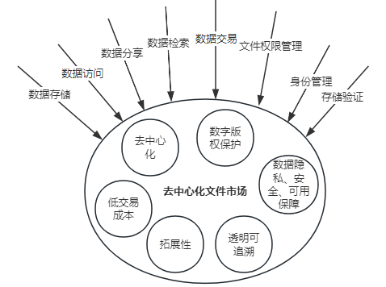
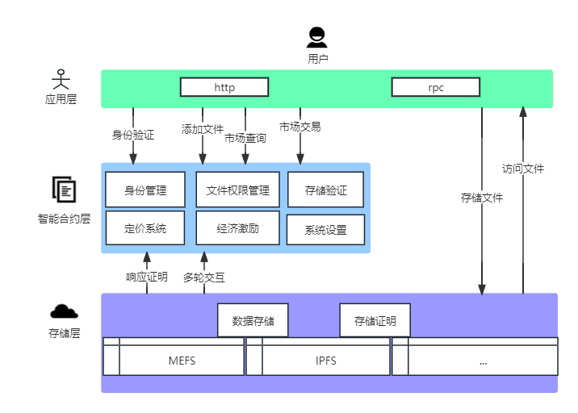

# FileDNS: The next generation decentralized file market protocol

## Introduction

The digital age has granted people more opportunities to create and share content, and decentralized file markets are empowering content creators and users by redefining digital file management and transactions through innovative technologies and concepts. As digital content continues to increase, decentralized file markets have become a key element of the digital economy. The core goal of these markets is to achieve the storage, sharing, trading, and management of digital files while reducing reliance on platform control and intermediaries. As a Web3 middleware and infrastructure, FileDNS provides functions such as storage, data, indexers, access control, and data availability, and will leverage the latest technological trends and innovative concepts to achieve higher efficiency, safer guarantees, and a better user experience.

## 1. What is a Decentralized File Market?

A decentralized file market is a digital market based on blockchain technology that allows users to exchange, buy, sell, and manage digital files and content without relying on central control or intermediaries. They are built on decentralized computing platforms, distributing files and metadata to multiple network nodes, thus providing higher security and availability. Users can share various types of content, such as documents, images, audio, video, and other data, without relying on traditional central servers. These markets are based on blockchain technology and smart contracts, providing the following key features and advantages:

* **Decentralization**: Decentralized markets do not rely on a single central server or intermediary. Instead, they use blockchain technology to distribute files and transaction information across multiple nodes, reducing the risk of single points of failure and improving availability.

* **Digital Copyright Protection**: Through smart contracts, decentralized file markets can automatically execute digital copyright and intellectual property rules. This means that content creators can better control their works and ensure fair compensation.

* **Low Transaction Costs**: Blockchain transactions are usually cheaper because they do not require intermediary fees. This reduces the cost of buying and selling files and content, especially for small transactions and micropayments.

* **Transparency and Traceability**: Blockchain technology provides complete transparency, allowing users to view the history and transaction records of files. This helps build trust and prevent fraud and piracy.

* **Scalability**: By using blockchain and decentralized storage technologies, decentralized file markets can easily scale to meet growing demands.

## 2. Technical Foundation

FileDNS, as a decentralized file market protocol, encompasses a series of innovative technologies that allow users to share, trade, and manage digital files without relying on central intermediaries. The key technical foundations of FileDNS are as follows:

### 2.1 Blockchain

Blockchain is the cornerstone of decentralized file markets. It is a distributed, immutable ledger used to record the ownership, transaction history, and smart contract rules of files. Blockchain technology provides secure transaction records and transparency, allowing users to track the source and transaction history of files.

### 2.2 Smart Contracts

Smart contracts are automated contracts executed on the blockchain. In decentralized file markets, smart contracts manage digital copyrights, transaction rules, and payments. When users purchase files, smart contracts automatically handle payment, file licensing, and transfer of ownership.

### 2.3 Decentralized Storage

Traditional file storage usually relies on central servers, which are vulnerable to single point of failure. Decentralized file markets use decentralized storage technologies such as MEFS or IPFS to distribute files across multiple nodes in the network. This improves file availability and security.

### 2.4 File Identifiers

File identifiers are identifiers used to uniquely identify and reference files or data objects, making it easier for users to locate and access the files they need. Users can conveniently locate, purchase, share, and verify files. Each file has its own identifier, ensuring that there are no duplicate files in the market, avoiding redundancy and confusion.

## 3. Basic Concepts of FileDNS

FileDNS is a decentralized market protocol that allows for the storage, sharing, trading, and management of files without relying on traditional centralized institutions (such as CNKI). Users have complete control and ownership of their files. It is inclusive, supporting not only artistic creations like photography, paintings, music, videos, and academic papers, but also various other types of data such as blockchain data, surveillance videos, application backup data, and code files. Transactions are fair and transparent, with file prices publicly available and transaction histories traceable. File asset owners have complete control over their files, and their privacy, security, and availability are effectively protected without the owner's authorization.

FileDNS is an important innovation that helps address the challenges of data file management and trading, such as excessive reliance on centralized institutions, insufficient data availability guarantees, chaotic digital identity management, and the singleness of file types in file markets. FileDNS utilizes advanced DID (Decentralized Identity) technology to return the control of digital identities to users and innovatively extends file management permissions to the mfileDID module, achieving users' 100% independent and flexible control and management of files. Additionally, FileDNS combines the current Layer 2 market's fraud proof and multi-round interactive verification ideas to effectively guarantee data availability.

## 4. Technical Architecture of FileDNS

The technologies involved in FileDNS are very extensive and professional, including cryptographic operations, checksums, and data processing, P2P networks, blockchain data, smart contracts and virtual machines, decentralized storage, DID decentralized identity management, mFileDID decentralized file permission management, file unique identifiers, and file storage fraud proof. The details of each aspect of technology are sufficient to analyze a separate article, but the overall framework of FileDNS still belongs to a decentralized file market protocol oriented towards Web3.0 middleware and infrastructure.

The technical architecture of FileDNS can be analyzed from three levels. First, from a global perspective, the FileDNS architecture is divided into the application layer, smart contract layer, and storage layer. As shown in the figure below.

## 4.1 Application Layer

The application layer of FileDNS is the frontend part of the decentralized file market protocol, providing users with interfaces and functions to interact with the system. It mainly provides users with access to identity management, file storage, file access, file sharing, file trading, and management functions, aiming to make user operations simpler, more convenient, clearer, smoother, and safer. The application layer has the following functional features:

* **User-friendly interface**: The application layer of FileDNS provides a user-friendly interface, making it easy for users to browse, search, upload, and manage files. This includes web interfaces, mobile applications, and other interactive channels, allowing users to choose the most suitable way to access FileDNS according to their needs.

* **File search and discovery**: The application layer provides users with powerful file search and discovery functions. Users can use keywords, tags, or categories to find files they are interested in, allowing them to quickly find the content they need.

* **File upload and management**: Users can easily upload and manage their files through the application layer. This includes creating unique identifiers for files, defining file permissions and access control, and viewing file metadata.

* **Buying and selling files**: The application layer of FileDNS supports users in buying and selling files. Users can complete transactions using cryptocurrencies, and smart contracts ensure the security and reliability of transactions.

* **User identity management**: Users can manage their decentralized identities in the application layer, which involves creating, managing, and authorizing digital identity identifiers. This helps ensure the security and controllability of users' identities on the network.

* **Instant messaging and social features**: The application layer usually includes instant messaging and social features, allowing users to communicate with each other, share files, and establish social relationships.

* **Multi-platform support**: The application layer of FileDNS usually supports multiple platforms, including web, mobile devices, desktop applications, etc. This allows users to easily access their files and management functions across different devices.

The application layer of FileDNS is the entrance for users to interact with the decentralized file market, allowing users to conveniently manage and access their files, as well as participate in file transactions and sharing. Of course, the various modules of the application layer can also be segmented separately as independent applications to combine with other projects, unlocking more unique applications and contributing to the Web3.0 industry.

## 4.2 Smart Contract Layer

The contract layer of FileDNS is a key component of the decentralized file market protocol. It contains multiple important modules, covering identity management, file permission management, and storage verification, as well as pricing, economic incentives, and system settings. Among them, identity management, file permission management, and storage verification modules are the core functions of FileDNS. The following is a brief introduction to the core modules of the contract layer:

* **Identity Management**: Responsible for managing user identities. Each user can create a decentralized identity, meaning they have their own identity information and digital identity identifiers. This identity information is usually associated with blockchain decentralized identity identifiers (DID) to ensure the uniqueness and security of identities.

* **File Permission Management**: The contract layer of FileDNS provides fine-grained file permission management. Users can define who can access and share their files and also define the transaction details of the files. This is all controlled through smart contracts to ensure that only authorized users can access files, increasing the privacy and security of files and providing strong protection for the file market.

* **Storage Verification**: The storage verification module is responsible for verifying the integrity and availability of files. This usually involves integration with decentralized storage systems to ensure that files have redundant backups on multiple nodes in the network, ensuring that files can still be accessed even if some nodes are unavailable.

Decentralized file market protocols include file storage fees, file transaction fees, etc. Setting fair and transparent fees through an oracle mechanism is crucial for market participants. A well-performing market protocol usually requires good economic incentives. An excellent economic incentive scheme will promote active participation of various users in the decentralized file market, including data storers, data availability guardians, users who only store data, and users who mainly engage in file transactions.

FileDNS aims to make decentralized identity management and decentralized file permission management industry standards,while innovatively implementing file storage proof on the chain, thereby more effectively and at a lower cost ensuring the availability, integrity, and privacy of files, allowing users to manage their files securely, define file access permissions, and interact with other users.

### 4.3 Storage Layer

The storage layer is the cornerstone of FileDNS, providing a solid technical foundation for the decentralized file market. FileDNS adopts decentralized file storage technology, which means that files no longer rely on a single central server. They are stored across multiple nodes in the network, and this distributed approach improves the availability and resilience of files because even if some nodes are unavailable, the files can still be accessed.

MEFS and IPFS are two leading decentralized file storage projects that provide efficient and sustainable solutions for FileDNS's file storage. In the future, FileDNS will also support more excellent storage projects like these. FileDNS uses a commitment value to uniquely identify and locate files. This value is not only used to identify files but also to verify the integrity of files, which means users can download files with confidence because their commitment values will help confirm that the files have not been tampered with. The storage layer also includes data redundancy and backup mechanisms to ensure the persistence of files, with files stored on multiple nodes, reducing the risk of data loss. The work of the storage layer also involves interaction with smart contracts. Smart contracts are used to manage file transactions, leasing, purchasing, and authorization, and file storage and access permissions are also controlled through smart contracts, increasing the security and controllability of files.

The storage layer of FileDNS provides scalable and efficient file storage solutions for the decentralized file market, allowing users to manage their digital assets in a more decentralized and sustainable way while ensuring high availability and security of files.

## 5. Core Functions of FileDNS

The core functions of FileDNS include identity management (DID, Decentralized Identity, decentralized identity identifier) and file rights management (mfileDID), as well as storage proof (FileProof). Let's delve deeper into these functions.

### 5.1 Identity Management

With the continuous development of the Internet, the value of user personal data has been continuously discovered. The identity system and personal data value are huge, but these values do not belong to users themselves but are controlled by large companies, and there are data privacy leakage issues. Currently, data privacy-related issues have become a very big market problem. Based on this situation, in the Web3.0 era, returning personal identity content to users themselves and allowing users to own their identity data has become a trend.

FileDNS uses DID technology to achieve user identity management. In the World Wide Web Consortium (W3C), [DID](https://www.w3.org/TR/did-core/) is introduced as follows:

> Decentralized Identifiers (DIDs) are a new type of identifier that enables verifiable, decentralized digital identity. A DID refers to any subject (e.g., a person, organization, thing, data model, abstract entity, etc.) identified by the DID. In contrast to typical federated identifiers, DIDs are designed to be independent of centralized registries, identity providers, and certificate authorities. Specifically, while other parties may be used to help discover information related to a DID, the design enables the controller of a DID to prove control over it without permission from any other party.

In the digital age, individuals and entities need a secure, controllable, and decentralized way to manage their identity information. Decentralized Identifiers (DID) have become cutting-edge technology to meet this need. It is the next big step in digital identity management, with the potential to completely change the way we interact with identity information. DID is a digital identifier used to uniquely identify an entity, such as an individual, organization, or thing, without the intervention of a central authority. Unlike traditional authentication methods, DID returns control to the subject of the identifier, allowing them to manage and verify their identity information independently. DID has these advantages:

* **Ownership of Data**: Data (such as transaction records, owned NFTs, and other information) is entirely controlled by the owner themselves, without the need for any centralized third party. Any information about your identity is completely in your own hands, and no one or company can obtain it without your authorization.

* **Data Integration**: In the Web2.0 era, users need different accounts and passwords to log in to different platforms. In the Web3.0 era, users can authorize logins to different platforms and websites through a single wallet.

DID represents the future of digital identity management, providing users with greater privacy and control, and its gradual popularity will change the way we interact with identity information, thus achieving a more secure, transparent, convenient, and decentralized file market.

### 5.2 File Rights Management

FileDNS is a leading platform for digital file management and trading, and file rights management is one of the core functions of the platform. It provides users with fine-grained control and trading, allowing them to flexibly manage and trade the files they upload. File rights management is a technology and strategy used to control who can access, share, manage, and trade specific files. It ensures the security, privacy, and integrity of files while allowing file owners to manage the use of files flexibly.

FileDNS names its file rights management technology mfileDID, providing users with more advanced control through its unique file rights management features. It has the following key aspects:

* **File Identity Identifier**: Each file has a unique file identity identifier, allowing file owners to manage the permissions and access control of each file individually.

* **Fine-grained Authorization**: Users can define file access permissions, from fully public to fully private, and all intermediate states. They can specify who can view, share, trade, and download files.

* **User Management**: File owners can add or remove other users and assign them different levels of permissions, allowing for multi-person collaboration and ensuring that files are only visible to authorized users.

* **Decentralized File Market**: FileDNS has a decentralized file market, allowing users to trade files without intermediaries, with users communicating directly, increasing efficiency.

* **Uniqueness and Transparency**: Each file has a unique identifier, allowing users to view file metadata and sources. This helps users make informed purchasing decisions.

* **Automatic Execution**: Permission settings are automatically executed through smart contracts, ensuring the security and reliability of files, meaning that permissions will be followed even without central management.

* **Digital Asset Exchange**: FileDNS also supports the exchange of digital assets, from non-fungible tokens (NFTs) to content files (such as videos, papers, etc.), expanding the platform's application range and allowing users to exchange various digital assets.

FileDNS's file rights management provides users with a friendly and highly secure file management and trading solution. These functions strengthen file privacy and security, promoting the sharing and communication of files as digital assets. FileDNS's comprehensive functions make it a comprehensive platform for decentralized file storage, management, and trading.

### 5.3 Storage Proof

FileDNS's decentralized storage proof is an important feature of the platform. It ensures the security and availability of users' uploaded files during storage and transmission through blockchain Layer2 technology and innovative applications of cryptography. Decentralized storage proof is a technology used to verify whether the files uploaded by users to FileDNS are securely stored in the network, whether they have been tampered with, and whether they can be accessed at any time. And the verification process does not expose the user's file data itself. This proof is implemented through blockchain technology, smart contracts, and interaction with the storage layer.

FileDNS uses a decentralized storage proof system called FileProof. It has the following features:

* **File Integrity Verification**: FileProof regularly verifies whether the files uploaded by users are intact during the storage process. If any part of the file is modified or damaged, the system will detect it immediately and take corresponding measures, such as repair or alert.

* **Decentralized Storage**: Users' files are stored in a decentralized manner in the FileDNS network, which means that files are not only stored in one place but also distributed across multiple nodes. This improves the redundancy of files and reduces the risk of loss or damage.

* **Immutable Proof**: Storage proof is immutable because they are recorded on the blockchain. This means that once the proof is generated, they cannot be modified or deleted.

* **Low Proof Cost**: FileDNS uses advanced technology, with a smaller chain  proof overhead to achieve data proof in local storage, reducing the cost of storage provers and verifiers, and encouraging the prosperity and expansion of the market.

* **File Privacy Protection**: Verifiers do not need to know the content of users' files to achieve verification of their storage proof, which excellently protects the privacy of users' files.

* **Automatic Execution**: The checks and verifications of FileProof are automatically executed, without central management. If there are problems, smart contracts will automatically take measures to protect users' files.

Through FileDNS's storage proof mechanism, individual users, businesses, media, and content creators can ensure that their files, data, intellectual property, digital works, etc., are securely stored and protected on FileDNS. FileDNS's decentralized storage proof provides users with a highly reliable storage solution, protecting their files from damage and strongly guaranteeing the availability of user files. This technology has pushed decentralized file management to a new level, enhancing the availability and privacy of files.

## 6. Advantages and Innovations

With the rapid growth of digital information, the storage, management, security, and trading of files have become core needs in our digital life.

Current projects related to this demand include IPFS, Filecoin, Arweave, Greenfield, Opensea, Ocean Protocol, etc. Among them, IPFS, Filecoin, and Arweave are currently mainstream decentralized storage projects. Greenfield is the third chain in the BNB ecosystem, focusing on decentralized storage. Opensea is the world's largest comprehensive NFT trading platform, and Ocean Protocol is a decentralized data exchange protocol supported by blockchain technology and cryptographic tokens.

IPFS is currently the most widely used protocol for storing NFT images and Metadata. It is very suitable for storing high-access-frequency "hot" data. However, IPFS does not have any built-in ways to incentivize storage, prove that data is correctly stored, or establish agreements between participants like a blockchain. This means that if data is only stored on IPFS, there is a risk of data loss. For example, Infura's IPFS service will delete data that has not been accessed within six months. Therefore, if you want to keep data available for a long time, it is best to run your own IPFS node.

Filecoin offers low storage costs, mainly for storing "cold" data, such as archived data. Filecoin does not have a built-in data retrieval fee mechanism. Currently, some miners accept low-quality data to get rewards and refuse to assist in data retrieval, resulting in a large amount of junk data stored on Filecoin. At the same time, its use of Proof of Replication, Proof of Space, etc., involves a large number of transactions and occupies most of the network's transactions on Filecoin.

Arweave is a permanent decentralized storage network, and its design goal is to ensure that files are not deleted. Arweave's single storage cost is relatively high, but the permanent storage cost is relatively low. Arweave's storage efficiency is relatively high because the data needs to be permanently stored on the blockchain, and each node needs to store a complete copy of the data. In addition, Arweave's data privacy protection is not strong.

BNB Greenfield is a storage-centric blockchain that interacts with decentralized network storage providers (SPs), allowing users to upload data with unique access and usage rights. However, Greenfield's philosophy aims to help users and DApps create, store, and exchange their fully owned data and form a new data economy.

Opensea, as an NFT trading platform, has already been very successful, but it only serves as a platform for the purchase and sale of digital art and does not provide good support for more types of digital assets.

Ocean Protocol mainly builds a decentralized platform for data sharing. FileDNS is committed to creating a next-generation decentralized file market protocol, presenting a fair, transparent, and free file market. As a Web3 middleware and infrastructure, it better promotes the development of Web3 in various aspects of society.

The biggest difference of FileDNS is that it has the consciousness to build an ecosystem. Data is an asset, and storing data alone is far less attractive than adding management and trading of data. Users and DApps can not only create, store, and exchange their fully owned data but also manage file permissions more finely and trade files more conveniently and fairly. In addition, FileDNS also has more comprehensive identity management and lower-cost storage proof. The concept of FileDNS aims to create a simple, convenient, secure, and comprehensive file market without intermediary intervention, providing not only reliable storage services for Web3.0 applications but also a rich and intermediary-free trading and management market for the digital economy in the Web3.0 field.

FileDNS has these advantages:

- **Decentralized File Management**: FileDNS adopts a decentralized design, returning the control of file management to users. No longer relying on a single central entity means users can better control their files while reducing the risk of data loss.

- **DID Identity Management**: FileDNS uses decentralized identity identifiers (DID) for management, allowing users to conveniently, securely, and privately verify their identities. This helps ensure that only authorized users can access files, increasing file security.

- **Fine-grained File Permission Management**: FileDNS's permission management system allows users to set detailed access permissions for their files, including viewing, sharing, downloading, and trading, providing more control and privacy and covering more file market needs.

- **Convenient File Trading Platform**: FileDNS categorizes various digital assets through tags, keywords, and descriptive information. Asset owners set prices directly without intermediary intervention. The interface design will adopt a simple and intuitive design philosophy and provide important search functions, making it easy for users to upload, manage, sell, and purchase files.

- **Efficient, Low-cost, and Reliable Storage Proof**: FileDNS's storage proof system uses a low-cost method to ensure the availability and privacy of files during storage and transmission. This technological innovation ensures the reliability of storage, reduces storage proof costs to the lowest, and avoids the impact on storage scalability in the later stage.

## 7. Applications and Use Cases

To attract more people to participate in Web3.0 and stimulate the creation of a new batch of DApps, FileDNS can unlock the following applications:

* **Personal Cloud Storage**. Relying on FileDNS, users can create their own network drives with private keys, allowing them to upload and download their encrypted files, photos, and videos through desktop and mobile devices.

* **Blockchain Data Storage**. L1 blockchain contains tens of TBs of historical data, most of which are dormant. FileDNS can be used to store this data to improve the availability of L1 data. In addition, it can also store L2 summary transaction data at a lower cost.

* **Personal and Enterprise Data Market**. Get rid of the control and profit grabbing of centralized institutions, creating a more fair, transparent, convenient, and independently controlled file data market.

* **Publishing Content**. Creators can upload their works to FileDNS for storage, public promotion, or private sharing, or they can sell them privately. After the buyer pays, the creator will grant read permission to the buyer's address to complete the transaction.

* **Social Media**. FileDNS can provide a basic platform architecture for social media influencers or key opinion leaders, allowing them to fully own their content and data. After payment, DApps can use this data and can also publish this data to the public through decentralized social networks.

* **Artificial Intelligence Model Training**. Current artificial intelligence large models are successively launched to accelerate the empowerment of industrial development, and the development of artificial intelligence requires large-scale data training. To promote the combination of blockchain and artificial intelligence, the decentralized file market can provide a unified interface to provide various data and promote users and enterprises to upload related data to the decentralized file market to directly obtain file trading benefits.

FileDNS can manage your identity information across platforms and privately, and the control is entirely in the hands of the user itself. It provides users with secure, reliable, and private storage services, and users have full ownership and control over the data. In addition, FileDNS also provides users with fine-grained file permission control, creating a fair, transparent, and flexible trading platform.

## 8. Future Outlook

From the above, it can be seen that with the arrival of FileDNS, a wave of innovative and transparent new DApp Web3 business models may emerge one after another. More applications that have been criticized in the Web2 world and have gradually lost user trust will move to the Web3.0 world. The popular NFT trading market will also expand to a more content-rich decentralized file market, and the creation of knowledge and art will be explosively stimulated.

To fully unleash the potential of Web3.0, the next issues to be solved are a fast and simple user experience comparable to Web2, the intensity of product concept promotion, and excellent chain expansion and acceleration technology. FileDNS will continue to work together with the entire Web3 community to benefit the next generation of users.

## Conclusion

FileDNS is not only a decentralized file market protocol but also a reflection of technological innovation. Its comprehensive functions enable users to better manage their identity information, better protect, share, manage, and trade their digital files while reducing the risks and costs associated with traditional file management systems. With the continuous development of digital life and Web3 technology, FileDNS provides us with a more flexible, convenient, fair, secure, and efficient file market solution.
